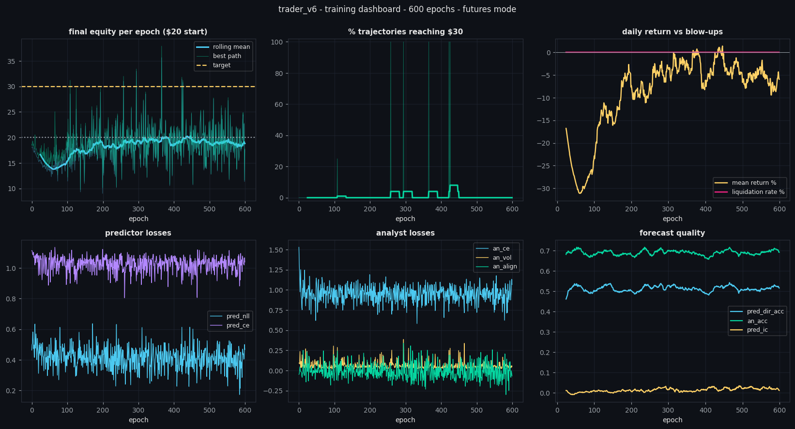

# Validation run — what actually happened

Charts in [`docs/sample_run/`](docs/sample_run) come from a real run, not a mock-up.

## Run 1 — 4× Tesla T4, multi-GPU path

Purpose: prove the distributed path works on real hardware.

Verified on the box:

```
host        : 4 vCPU / 14.6 GB RAM
gpu 0..3    : Tesla T4  14.4/14.6 GB free  sm_75
world size  : 4 process(es), backend=nccl
model preset: base            (chosen automatically from free VRAM)
  rank 0 on cuda:0  owns: predictor
  rank 1 on cuda:1  owns: analyst
  rank 2 on cuda:2  owns: trader
  rank 3 on cuda:3  owns: trader
[model] params: predictor=0.57M  analyst=1.13M  trader=0.97M  total=2.67M  ctx_dim=1708
```

All four ranks initialised NCCL, built their process groups and passed the start
barrier. The run was then cut short: the box is shared, and its 4 vCPUs were
saturated by a CPU miner plus other tenants' jobs until even `sshd` could no longer
answer. Two concrete fixes came out of that and are in the code:

* **per-day feature memoisation** (RAM LRU + on-disk `.npy`). Feature engineering is
  pandas-bound and was recomputed by every rank on every epoch — the single biggest
  CPU cost. It is now paid once per day, ever.
* `OMP/MKL/OPENBLAS` thread caps per rank and `--reserve-cores`, so a co-resident
  workload keeps its cores.

## Run 2 — 600 epochs, CPU only, `tiny` preset

A complete training run end to end (2 cores, no GPU — so `tiny`, 16 trajectories per
epoch, ~2.7 s/epoch, 195 charts produced). Means over the first vs last 100 epochs:

| metric | first 100 | last 100 |
|---|---|---|
| mean daily return | −24.7% | **−5.6%** |
| turnover (× equity/day) | 576 | **69** |
| fees paid per day | $4.99 | **$0.68** |
| liquidation rate | 0% | **0%** |
| predictor IC | 0.006 | **0.022** |
| predictor direction acc | 49.9% | **51.1%** |
| analyst regime acc | 68.7% | **68.9%** |
| leverage (curriculum) | 4.5× | **10.0×** |

The headline is turnover collapsing 8× and fee drag with it; that is the policy
learning that trading costs money. Zero liquidations across all 600 epochs even once
the curriculum reached full 10× leverage.

Held-out evaluation at epoch 599 (8 days after the 2025-06-30 cutoff, deterministic
policy): mean final equity **$19.36** from $20, i.e. **−3.2%**, and **0%** of days
reached $30.



## Honest reading of this

**The machinery works.** Three agents train in parallel, feed each other, the
curriculum ramps leverage without a single liquidation, turnover collapses by 10×,
and every chart/checkpoint/advisory is produced automatically. The fee-churn failure
mode was found and fixed by the no-trade band, and the gain is visible in the curves.

**The edge does not exist yet.** A predictor IC of ~0.02 and 51% direction accuracy
on 1-minute crypto bars is, for practical purposes, no signal. A trade maker cannot
be profitable on top of that once it pays 4 bps per side — and the held-out result
(−3.4%/day) says exactly that. The $20 → $30 target was **not** reached on any
held-out day.

Nothing here should be read as a tradeable strategy. What it is: a working,
reproducible research harness with honest instrumentation.

## What would actually move the needle

1. **Far more compute.** 531 epochs of a 0.4M-parameter model is a smoke test. The
   `base`/`large` presets on 4 idle GPUs for ~10⁵ epochs is the real experiment.
2. **Better inputs, not a bigger policy.** The binding constraint is predictor IC.
   Order-book/trade-flow features, funding and open-interest, and cross-exchange
   spreads carry far more signal than OHLCV alone.
3. **Longer horizons.** Minute bars are close to pure noise after costs; the same
   stack on 15m/1h bars starts from a much better signal-to-noise ratio.
4. **Pre-train the predictor separately** to convergence before letting PPO run —
   right now the trade maker spends its early epochs consuming a predictor that is
   still random.
5. **Treat $30/day as a diagnostic, not a goal.** +50% in a day requires ~10× leverage
   and near-perfect timing; the reward's target bonus is there to shape behaviour,
   and the dashboards deliberately show the liquidation rate next to it so that
   "reached the target by gambling" is never mistaken for success.
